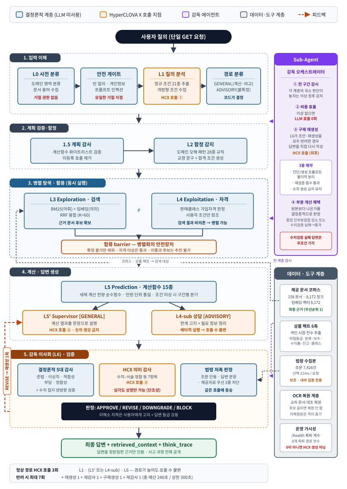

# 연금 Agent 기술 제안서

**제10회 미래에셋증권 AI Festival · 연금 Agent 트랙**

---

## 0. 문서 정보

| 항목 | 내용 |
|---|---|
| 과제 | 대고객 연금 질의 응답 및 상품 설명 AI Agent |
| 답변 생성 모델 | HyperCLOVA X (HCX-005) — 답변 문장 생성 전 구간 전용 |
| 평가 API | `GET /answer?question_id={id}&question={질의}` |
| 소스 규모 | Python 62개 모듈 · 18,139행 |
| 회귀 테스트 | **1,268건 전량 통과** (테스트 파일 59개) |
| 코퍼스 | 제공 문서 158건 · 8,172 청크 |

> **본 문서의 수치 표기 원칙.** 이 제안서에 기재된 모든 정량 수치는 실제 배포
> 서버에서 실행한 진단 명령의 출력, 또는 저장소의 테스트 실행 결과에서 직접
> 가져온 값이다. 추정치나 기대치를 실측치처럼 기재한 곳은 없다. 이 원칙은
> 시스템 자체의 설계 철학("계산은 함수, 설명은 LLM")과 같은 것이다.

---

## 1. 요약

본 시스템은 연금 도메인 질의에 대해 **제공 문서를 근거로만** 답변하는 다중 에이전트
오케스트레이션 시스템이다. 단일 LLM에 질의를 그대로 넘기는 방식이 아니라, **역할이
분리된 7개 계층과 1개 감독 에이전트**가 각자의 책임 범위에서만 판단하고, 그 판단이
서로를 검증하도록 구성했다.

### 설계의 출발점 — 환각(Hallucination) 억제

이 시스템의 모든 구조적 선택은 **하나의 문제의식에서 출발했다: 생성형 AI의
고질적 한계인 환각을 어떻게 최대한 억제할 것인가.**

현재 수많은 연구가 환각을 줄이기 위한 방법을 제시하고 있지만, 환각을 완전히
통제하는 것은 아직 가능하지 않다는 것이 현실이다. 모델의 규모를 키우거나
프롬프트를 정교하게 다듬는 것만으로는 "그럴듯하지만 사실이 아닌 문장"이 생성될
가능성 자체를 없애지 못한다.

그런데 연금은 **잘못된 정보가 곧바로 사용자의 금전적 손해로 이어지는 영역**이다.
세액공제 한도를 잘못 안내하면 실제 납입 계획이 틀어지고, 과세 기준을 잘못
설명하면 인출 시점의 세금이 달라진다. 즉 이 도메인에서는 "가끔 틀릴 수도 있는
답변"이 허용되지 않는다.

그래서 나는 **모델이 환각을 일으키지 않기를 기대하는 대신, 환각이 발생하더라도
사용자에게 도달하지 못하도록 막는 구조**를 설계 목표로 삼았다. 아래 세 가지
차별점은 모두 이 목표에서 파생된 것이다.

**첫째, LLM에게 숫자를 만들게 하지 않았다.** 환각이 가장 치명적으로 나타나는
지점이 수치이므로, 연금 세제 계산은 15종의 순수 함수가 결정론적으로 수행하도록
분리하고 LLM은 그 출력을 설명하는 문장만 만들도록 했다. 여기서 그치지 않고,
답변에 등장한 모든 수치가 계산 결과·근거 문서·질의 원문 중 하나에 실재하는지
사후 대조하며, 대조에 실패한 답변은 폐기하도록 설계했다. **생성 단계에서 막고,
검증 단계에서 한 번 더 막는 이중 구조**다.

**둘째, 판정 권한에 계층을 두었다.** LLM 기반 의미 감사는 심각도를 **올릴 수만
있고 내릴 수 없도록**(단조성) 제한했다. 결정론적 규칙이 내린 판정을 LLM이 뒤집지
못하게 하여, "모델이 스스로의 출력에 관대해지는" 실패 양식을 구조적으로 차단하고자
했다. 검증자가 피검증자와 같은 성질(확률적 생성)을 가진다면 검증은 성립하지
않는다고 판단했기 때문이다.

**셋째, 실패를 숨기지 않도록 했다.** LLM 호출이 실패해 결정론적 템플릿으로
축퇴하는 경로 8곳 전부를 계수하여 `/health`로 노출하도록 설계했다. 이 값이 0이
아니면 그만큼이 HyperCLOVA X가 생성하지 않은 답변이라는 뜻이며, 운영자가 이를
즉시 확인할 수 있다.

이 구조는 **유지보수와 운영 관리 측면에서도 큰 이점을 가진다.** 장애가 발생했을
때 "어느 계층에서 무엇이 실패했는지"가 계수와 사유로 남기 때문에, 로그를 뒤져
원인을 추측하는 대신 지표를 보고 곧바로 문제 지점을 특정할 수 있다. 또한 각
계층의 책임 범위가 분리되어 있어, 한 계층을 수정할 때 다른 계층에 미치는 영향
범위가 명확하다. 실제로 개발 과정에서 발견한 결함들을 **좁은 범위의 수정으로
해결할 수 있었던 것도 이 구조 덕분**이었다.

---

## 2. 문제 정의

### 2.1 이 도메인이 어려운 이유

연금 질의는 일반적인 문서 QA와 세 가지 지점에서 다르다.

**(1) 틀린 답이 금전적 손해로 직결된다.** "1,500만원을 초과하면 초과분만 과세된다"는
흔한 오해를 그대로 수용해 답하면, 고객은 실제로 잘못된 인출 계획을 세운다. 따라서
**질문에 담긴 잘못된 전제를 식별하고 교정하는 능력**이 필수다.

**(2) 제공 문서 자체가 불완전하다.** 실물 코퍼스 158건에는 OCR 판독 실패 5,279건이
포함돼 있고, 이는 깨진 페이지 198건에 집중되어 **페이지당 평균 26.7건** 밀도로
분포한다. 또한 개정 전 세법 수치(700만원·1,200만원 등)를 담은 문서가 현행 수치
문서와 혼재한다.

**(3) 단정적 추천이 금지된다.** 과제 요건상 "이 상품을 추천합니다"는 답변이 될 수
없다. 확인해야 할 조건을 먼저 제시하고 **상황별로 나누어** 결론을 제공해야 한다.

### 2.2 설계 목표

위 제약에서 다음 목표를 도출했다.

| 목표 | 구현 전략 |
|---|---|
| 수치 정확성 | 계산을 LLM에서 분리하여 순수 함수로 이관 |
| 근거 기반성 | 답변의 모든 수치를 근거 집합과 사후 대조 |
| 오답 방지 | 도메인 함정 28종을 사전 감지하고 교정 반영을 강제 |
| 정보 한계 대응 | 답변 불가 시 거절이 아니라 한계 고지 또는 역질문 |
| 재현 가능성 | 경로 분류·판정은 전부 결정론적 코드가 담당 |

---

## 3. 시스템 아키텍처 — 다중 에이전트 오케스트레이션

### 3.1 전체 구조

본 시스템은 **오케스트레이터–워커(orchestrator–worker) 패턴**과 **평가자–최적화기
(evaluator–optimizer) 피드백 루프**를 결합한 계층형 다중 에이전트 구조다. 파이프라인은
5개 단계로 묶었고, 각 단계는 결정론적 워커와 LLM 워커가 역할을 나누어 담당하도록
했다. Sub-Agent가 전 단계를 횡단 감독하고, 별도의 데이터·도구 계층이 모든 단계에
근거를 공급하도록 구성했다.



### 3.1.1 단계별 역할 요약

| 단계 | 구성 계층 | 담당 역할 | LLM |
|---|---|---|---|
| **1. 입력 이해** | L0 사전 분류 | 도메인 영역 분류·문서 용어 수집. **거절 권한 없음** | — |
| | 안전 게이트 | 빈 질의·개인정보·프롬프트 인젝션 차단. **유일한 거절 지점** | — |
| | L1 질의 분석 | 정규 조건 21종 + 개방형 조건 추출 | **HCX ①** |
| | 경로 분류 | GENERAL(계산·비교) / ADVISORY(불특정) 결정. **코드가 결정** | — |
| **2. 계획·함정** | 1.5 계획 감사 | 계산함수 화이트리스트 검증, 미등록 호출 제거 | — |
| | L2 함정 감지 | 도메인 오해 패턴 28종 판정, 교정 문구·합격 조건 생성 | — |
| **3. 병렬 탐색·활용** | L3 Exploration | BM25 + 임베딩 RRF 융합 검색으로 근거 후보 확보 | — |
| | L4 Exploitation | 판매클래스 가입자격 판정. **사용자 조건만 참조** | — |
| | 합류 barrier | 확정 불가 후보만 제외, 자격 미상은 통과 | — |
| **4. 계산·생성** | L5 Prediction | 계산함수 15종 실행, 조건 미상 시 구간별 분기 | — |
| | L5' Supervisor | 계산 결과를 문장으로 설명. **숫자 생성 금지** | **HCX ②** |
| | L4-sub 상담 | 한계 고지 + 필요 정보 정리 (L5'와 배타적) | **HCX ②** |
| **5. 감독·검증** | 결정론적 5대 감사 | 준법·이상치·적합성·부담·정합성 + 수치 접지 양방향 | — |
| | HCX 의미 감사 | 수치–서술 정합 등 7항목. **심각도 상향만 가능** | **HCX ③** |
| | 법령 저촉 판정 | 3중 차단선 검증, 의미 감사와 같은 호출에 동승 | (③에 포함) |
| **횡단** | Sub-Agent | 전 구간 감시, 구제 재생성, 부분 개선 채택 판정 | 이상 시만 |

### 3.2 왜 단일 에이전트가 아닌가

이 구조를 채택한 이유는 **역할을 분리해야만 검증이 성립하기 때문**이다. 하나의
모델이 질의 분석·검색·계산·생성·검증을 모두 수행하면, 검증 단계에서 자신이 만든
결과를 스스로 심사하게 된다. 이는 자기 확증 편향을 구조적으로 허용하는 설계다.

그래서 다음과 같이 권한을 분할했다.

| 에이전트 | 권한 | 금지 사항 |
|---|---|---|
| L1 질의 분석 | 조건 추출, 슬롯 생성 | 경로 결정 불가 (코드가 결정) |
| L5' Supervisor | 문장 생성 | **숫자 생성 불가** |
| L4-sub 상담 | 문장 생성 (불특정 질의) | 근거 없는 수치 사용 불가 |
| L6 의미 감사 | 심각도 **상향만** | 결정론적 판정 완화 불가 |
| Sub-Agent | 진단 · 구제 재생성 | 진단 프롬프트로는 답변 작성 불가 |

특히 **Sub-Agent는 진단용 프롬프트(`SUB_AGENT_SYSTEM_PROMPT`)와 생성용
프롬프트(`SUB_AGENT_REWRITE_PROMPT`)를 물리적으로 분리**했다. 진단 프롬프트의 핵심
규칙은 "답변을 작성하지 마십시오"이며, 여기에 생성 권한을 섞으면 정상 흐름에서
진단만 해야 할 계층이 답변을 쓰기 시작한다. 이 분리를 회귀 테스트로 고정해 두었다.

### 3.3 LLM 호출 예산

정상 경로에서 HyperCLOVA X 호출은 **3개소**다 — L1, (L5' 또는 L4-sub), L6.
L5'와 L4-sub를 배타적으로 두어 경로가 늘어도 호출 횟수가 증가하지 않도록 했다.

감독이 답변을 반려한 경우에만 호출이 증가한다.

| 상황 | 호출 횟수 | 비고 |
|---|---|---|
| 정상 | 3회 | L1 · 생성 · 감사 |
| REVISE 발생 | 5회 | + 재생성 1회 + 재감사 1회 |
| 구제 재생성까지 | 7회 | + 구제 생성 1회 + 재감사 1회 |

**측정된 실제 응답 시간**은 자체 콘솔 실행 기준 11.4초 ~ 72.3초 범위였다. 주최측
공지의 문항당 타임아웃은 300초이고, 파이프라인 총 예산은 **240초**로 설정했다
(최악 경로 = HCX 7회 × (타임아웃 15초 + 재시도 1회) ≈ 210초 + 결정론 계층 1~2초 기준).

---

## 4. 핵심 설계 원칙

본 시스템의 모든 구현 결정은 다음 7개 원칙에서 파생됐다. 이 원칙들은 개발 중
발생한 실제 결함에서 귀납적으로 도출한 것이며, 각각 회귀 테스트로 고정해 두었다.

| 원칙 | 의미 | 위반 시 발생하는 실패 |
|---|---|---|
| 계산은 함수, 설명은 LLM | LLM이 숫자를 생성하지 않는다 | 그럴듯한 오답 수치 생성 |
| 판단은 코드, 문장은 LLM | 답변가능성 판정을 LLM 재량에 맡기지 않는다 | 같은 질의가 실행마다 다른 경로 |
| 사용한 것만 인용 | 검색 결과 전부가 아니라 실제 근거만 제시 | 무관한 근거로 인한 신뢰도 하락 |
| 모르면 되묻는다 | 조건 미확인 시 단정하지 않되 확인 항목은 2건 이내 | 사용자 부담 과다 |
| 감사는 심각도를 올릴 수만 있다 | LLM이 결정론적 판정을 완화하지 못한다 | 감사 계층 전체가 무의미해짐 |
| 결정론 규칙은 확실할 때만 | 완화가 불가능하므로 오탐이 미탐보다 나쁘다 | 정답이 규칙 때문에 강등 |
| 불특정 서술도 답한다 | 조건이 모자라면 거절이 아니라 한계 고지 + 역질문 | 답변 회피로 인한 정보 전달 실패 |

> **'불특정 서술도 답한다'는 소극적 방어가 아니라 고도화된 대응이다.** 이 원칙은
> 단순히 "거절하면 지표를 못 채우니 답하자"는 차원이 아니다. 정보가 불충분할 때
> 그냥 멈춰 버리는 것은 가장 쉬운 선택이지만, 사용자에게 남는 것이 없다. 반면
> 본 시스템은 **① 지금 있는 근거로 답할 수 있는 부분까지 답하고, ② 무엇이
> 확인되지 않아 여기까지만 답했는지를 정밀하게 탐지해 고지하며, ③ 어떤 정보를
> 주면 더 구체적으로 답할 수 있는지를 역으로 제시**한다. 즉 "모른다"를 "무엇을
> 알면 답할 수 있는지"로 변환하는 것이며, 이것이 정보 한계 상황에 대한 한 단계
> 높은 수준의 대응이라고 판단했다. 이를 구현하기 위해 ADVISORY 경로(L4-sub)를
> 별도로 두었다.

### 4.1 단조성(Monotonicity) — 이 시스템의 핵심 불변식

L6에서 HyperCLOVA X가 수행하는 의미 감사는 **심각도를 올릴 수만 있다.** 결정론적
감사가 REVISE로 판정한 사안에 대해 LLM이 APPROVE 의견을 내더라도 REVISE가 유지된다.

이 불변식이 필요한 이유는 명확하다. LLM 감사가 판정을 완화할 수 있으면, 모델이
자신의 출력에 관대해지는 순간 모든 결정론적 안전장치가 무력화되기 때문이다.
`merge_supervision()` 함수의 이 로직은 리팩터링 시에도 반드시 보존되어야 하므로,
전용 회귀 테스트로 고정해 두었다.

### 4.2 단조성에 기반한 정리 — 오탐이 미탐보다 나쁘다

LLM이 판정을 완화할 수 없다는 것은, **결정론 계층의 오탐(false positive)이 되돌릴 수
없는 강제 강등**이 된다는 뜻이다. 따라서 결정론 계층에는 확실히 옳은 규칙만 배치하고,
문자열로 결정할 수 없는 의미 판단은 규칙으로 흉내내지 않고 의미 감사로 위임하도록
설계했다.

---

## 5. 독자 설계 모듈 및 알고리즘

### 5.1 결정론적 계산 계층 (15종 순수 함수)

연금 세제 계산 전체를 LLM에서 분리하여 순수 함수로 구현했다. 각 함수는 반환 dict에
`source` 필드로 근거 문서 ID를 포함하도록 했고, 모든 계산은 **만원 단위**로 통일했다.

**단위 경계 방어.** 사용자 질의는 원 단위인 경우가 많다(예: "8000만원"). 원 단위
값이 만원 단위 계산 함수로 유입되면 1만 배 오차가 발생한다. 이를 막기 위해
`calc_params.py`의 `_VALID` 테이블에 각 인자의 제도상 상한(연금저축·IRP 개인납입
연 1,800만원 등)을 두고, 상한을 넘는 값은 **계산하지 않고 되묻는 항목으로 전환**하도록 했다.

**조건 미상 시 분기 계산.** 소득 구간을 모르면 계산을 포기하는 것이 아니라, 두
구간(총급여 5,500만원 이하 16.5% / 초과 13.2%)을 각각 계산해 `variants` 구조로
반환하도록 설계했다. 과제 요건인 "확인조건 제시 후 상황별 결론 제공"을 계산 계층에서
직접 지원하도록 만든 것이다.

### 5.2 도메인 함정 감지 (28종 규칙)

연금 도메인에서 반복적으로 관찰되는 오해 패턴 28종을 규칙화했다. 각 규칙은
`correction`(답변에 반영할 교정 문구)과 `verify_any`(반영 여부를 판정할 표현 집합)를
가지며, 감지된 함정이 답변에 반영되지 않으면 L6가 REVISE를 발동하도록 했다.

주요 함정 예시:

| ID 계열 | 함정 내용 |
|---|---|
| 연차 혼동 | 연금수령연차(수령한도 결정) ≠ 연금실제수령연차(퇴직소득세 감면율 결정) |
| 과세 범위 | 1,500만원 초과 시 **전액**이 과세 대상 (초과분만이 아님) |
| 재원별 과세 | 이연퇴직소득은 퇴직소득 과세기준, 세액공제분·운용수익은 기타소득세 16.5% |
| 세율 표기 | 15% vs 16.5%는 지방소득세 포함 여부 차이 (상충 아님, 15 × 1.1 = 16.5) |
| 구법 수치 | 700만원/1,200만원/4천만원은 개정 전 수치 |

**한국어 부분문자열 매칭 방어.** "불가능합니다"는 "가능합니다"를 포함하고,
"정해지는"은 "해지"를 포함한다. 실제로 '해지'를 단순 포함 검사로 넣었을 때
"정해지는"·"결정해지"·"이해지원"이 모두 오탐으로 걸렸다. 이 경험 이후 모든 규칙
어휘를 경계가 명시된 정규식으로 작성하도록 규칙을 세웠다.

### 5.3 상품 팩트 6축 색인 시점 추출

과제가 정의한 실적배당형 상품 데이터 축(상품분류·위험등급·판매클래스·총보수·
수익률·시장잔고)을 **색인 시점에 문서 전문에서 전수 추출**해 문서 메타데이터에
저장하도록 설계했다.

**왜 색인 시점인가.** 검색된 청크만 보는 방식은 검색이 해당 표를 놓치는 순간 사실이
통째로 사라진다. 즉 사실의 존재 여부가 검색 순위에 종속되는 것이다. 색인 시점
추출로 이 종속을 끊고자 했다.

**왜 정규식인가 (MRC/NER이 아니라).** 투자설명서는 `【제목】` + 파이프 표라는 규칙적
형태를 가진다. "이 상품의 위험등급이 몇 등급인가"는 생성이 아니라 **판단**이므로
"판단은 코드, 문장은 LLM" 원칙이 그대로 적용된다고 보았다. 확률적 span 추출 모델은
틀린 구간을 높은 확신으로 반환해도 결정론적으로 기각할 수 없고, 추가 모델 상주
비용도 발생하기 때문에 채택하지 않았다.

**위험등급 방향성 보존.** 위험등급은 **1등급이 가장 위험**하다. 숫자만 전달하면
"1등급이라 안전하다"는 정반대 서술이 생성될 수 있다. 그래서 값과 함께 원문 표기
(`4등급(보통 위험)`)를 싣고, 생성 프롬프트에 방향을 명시했으며, L6 의미 감사가
방향 오귀속을 별도 항목으로 점검하도록 했다.

**값 충돌 시 확정 보류.** 한 문서에서 서로 다른 등급·분류가 발견되면 값을 비우고
충돌 사유를 기록하도록 했다. 실측에서 12개 문서가 이 안전장치에 의해 확정 보류됐다
(예: `부동산`과 `채권형`이 함께 발견 — 한 투자설명서에 여러 펀드가 실린 경우).
억지로 하나를 고르는 순간 그것은 날조가 되기 때문이다.

### 5.4 OCR 손상 교차 문서 복원

제공 문서의 OCR 텍스트에는 판독 실패 문자가 포함돼 있다. 중요한 점은 **이 손상이
우리 디코더에서 발생한 것이 아니라는 것**이다(자체 디코더의 대체문자는 `?`가 아니라
`�`). 즉 판독기 교체로 해결할 수 있는 결함이 아니라고 판단했다.

**복원 원리 — 코퍼스의 중복성 활용.** 투자설명서들은 동일한
`[연금저축계좌 과세 주요 사항]` 표를 거의 그대로 싣는다. 따라서 깨진 자리의 앞뒤를
앵커로 삼아 다른 문서에서 같은 구절을 찾아 메우는 방식을 택했다. 이는 생성이 아니라
**코퍼스 내에 실재하는 텍스트를 가져오는 것**이므로 근거가 있고 결정론적이다.

다음 세 가지를 불변식으로 두었다.

1. **haystack은 복원 전 원문으로 한 번만 구성하도록 했다.** 고쳐가며 대조하면 한 번의
   오복원이 다음 복원의 근거가 되어 코퍼스 전체로 오염이 전파된다.
2. **후보가 갈리면 복원하지 않도록 했다.** 억지로 하나를 고르는 순간 날조가 된다.
3. **적재 시점 안전망을 유지하도록 했다.** 인덱스는 호스트 볼륨에 남아 재사용되므로,
   이미지를 새로 빌드해도 예전 인덱스의 손상은 사라지지 않는다.

**손상 패턴 일반화.** 판독 실패의 대체문자는 `?`만이 아니다. 실제 문서에서 인식
실패 자리를 **하나의 한글 음절을 반복해 채우는 형태**가 관찰됐다(예: "퇴퇴 퇴
퇴퇴퇴퇴 : IRP 퇴퇴퇴퇴"). 이는 이미지 기반 OCR이 확신을 잃었을 때 흔한 반복 붕괴
양상이다. 그래서 판정을 "특정 문자"가 아니라 **"같은 글자가 3회 이상 반복"**으로
일반화했다. 단, 숫자·영문·구두점은 판정 집합에서 제외하고자 했다 — "계좌번호
111222333444"가 손상으로 오탐되는 사례를 확인했기 때문이다.

**앵커 오염 방지.** 실측 결과 판독 실패 5,279건이 깨진 페이지 198건에 집중되어
페이지당 평균 26.7건 밀도를 보인다. 이 밀도에서 고정폭 앵커를 사용하면 앵커 안에
다른 손상 구간이 함께 잘려 들어와 대조가 **항상** 실패한다(검색어 자체가 이미
깨져 있기 때문). 그래서 앵커를 이웃 손상 구간을 넘지 않는 만큼만 취하도록 했고,
간격이 최소 길이에 미달하면 억지로 채우지 않고 정직하게 "앵커 부족"으로 분류하도록
설계했다.

### 5.5 수치 접지 검증 (양방향)

수치 검증은 **두 방향**으로 수행하도록 설계했다.

**방향 1 — 답변의 수치 → 근거 (날조 차단).** 답변에 등장한 모든 수치가 계산 결과·
근거 문서·질의 원문 중 하나에 실재하는지 대조한다. 실패하면 해당 답변을 폐기하고
결정론적 템플릿으로 대체하도록 했다.

**방향 2 — 계산 결과 → 답변 (도달 보장).** 방향 1만으로는 "LLM이 계산 결과를 아예
쓰지 않고 원론적 설명만 늘어놓는" 경우를 잡지 못한다(대조할 수치가 없으므로 그냥
통과한다). 실제로 "1억원, 연금수령 1년차 — 얼마까지 인출 가능?" 질의에서 한도
1,200만원을 정확히 계산해 놓고 답변에는 산정 방식만 서술한 사례가 있었다. 그래서
계산 결과가 답변에 실렸는지 역방향으로도 검증하고, 누락 시 계산함수 출력을
결정론적으로 덧붙이도록 보완했다.

**표시 반올림과 검증 기준의 정합.** 금액 표시는 만원 단위에서 정수로 반올림한다
(76.56 → "77만원"). 검증 대조 집합에 원본 값만 있으면 **시스템이 스스로 표시한 값이
'근거 없는 수치'로 판정**된다(77 vs 76.56 = 0.575%, 허용 오차 0.5% 초과). 해결책은
허용 오차 확대가 아니라(진짜 날조까지 통과시킨다) 표시형도 허용 집합에 포함하는
것이다 — 계산함수 출력에서 결정론적으로 파생된 값은 정의상 근거가 있다.

### 5.6 법령 접지 이중 판정

법제처 OPEN API로 수집한 법령 조문을 **내부 검증 전용**으로 활용하도록 설계했다
(과제 규정상 제공 자료가 최종 근거이므로, 조문은 `retrieved_context`에 포함하지
않도록 했다).

두 갈래의 판정을 수행하도록 했으며, **묻는 것이 다르므로 게이팅 조건도 다르게 두었다.**

| 갈래 | 묻는 것 | 게이팅 | 판정 반영 |
|---|---|---|---|
| 함정 판정 | 이 **함정**이 이 질의에 적용되는가 | 함정 ID 필요 | 함정 목록 조정 후 감사 재실행 |
| 저촉 판정 | 이 **답변**이 조문에 어긋나는가 | 조문만 있으면 됨 | REVISE로 **상향만** |

**3중 차단선.** 저촉 판정의 오탐은 강제 재생성 + 강등을 부르며, 단조성 때문에
되돌릴 수 없다. 그래서 세 겹의 검증을 두었다.

1. **조문 인용 검증** — 조문 원문 그대로의 인용이 있어야 한다(공백만 정규화하여
   대조, 최소 12자). 바꿔 쓰면 통과하지 못한다.
2. **답변 문장 검증** — 지목한 답변 문장(`answer_span`)도 답변에 글자 그대로
   존재해야 한다. 이 차단선이 없으면 모델이 실재 조문을 정확히 인용해 놓고
   **답변이 하지도 않은 말**을 저촉이라고 지어낼 수 있다.
3. **제공 자료 우선 검증** — 과제 규정상 제공 자료가 최종 근거이고 법령은 보조다.
   답변이 제공 문서와 일치하는데 조문과 어긋나는 경우, 그 저촉 판정은 **폐기**된다.

| 답변 ↔ 제공 문서 | 답변 ↔ 법령 | 처리 |
|---|---|---|
| 일치 | 어긋남 | **폐기** — 제공 자료 우선 |
| 불일치 | 어긋남 | **채택** — REVISE |
| 근거 0건 | 어긋남 | 채택 (뒷받침할 문서 없음) |

**조문 선택의 결정론성.** 어느 조문을 검토할지가 실행마다 달라지면 같은 질의가 매번
다른 검사를 받게 된다. 그래서 조문 선택을 결정론적 알고리즘으로 수행하도록 했고,
점수 동률은 조문 참조 문자열 순으로 해소하도록 정했다. 색인은 기동 시 미리
구축하도록 했다(실수집본 7,426건 기준 **구축 403ms · 요청당 선택 21ms** 실측).

**LLM 호출은 증가하지 않도록 했다.** 두 갈래 판정 모두 L6 의미 감사 **단일 호출**에
함께 싣는 방식을 택했다. 다만 페이로드는 증가하며(조문 4건 실릴 때 697자 → 3,772자 실측), 이에 맞춰
L6 단계 예산을 8.0초 → 10.0초로 조정했다.

---

## 6. RAG 설계

### 6.1 구성

검색 계층은 **BM25(어휘 검색)와 임베딩(의미 검색)을 RRF(Reciprocal Rank Fusion)로
융합**하는 하이브리드 구조다.

| 구성 요소 | 설정 |
|---|---|
| 어휘 검색 | BM25 |
| 의미 검색 | `intfloat/multilingual-e5-small` (로컬 임베딩) |
| 융합 방식 | RRF (상수 K=60, 표준값) |
| 융합 가중치 | 벡터 측 0.5 (조정 가능) |
| 색인 규모 | 158문서 · 8,172 청크 · 벡터 8,172 |

> **임베딩 모델 사용에 관한 규정 확인.** 답변 생성은 HyperCLOVA X 전용이라는 제약을
> 준수하며, 임베딩은 검색 순위 산출용 벡터일 뿐 답변 문장을 생성하지 않으므로 제약
> 대상이 아니기에 로컬에서 임베딩 모델을 활용했다는 점을 명시하고자 한다. 실제
> 설계에서도 답변을 만드는 4개 호출 지점은 전부 HyperCLOVA X를 기반으로 설계되었다.

**벡터·청크 정합성 모니터링.** 재색인 후 임베딩이 갱신되지 않아 벡터 수와 청크 수가
어긋나면 의미 검색이 조용히 무력화된다. 이를 감지하기 위해 `/health`가 두 값을 함께
노출하도록 했고, 불일치 시 경고 문구와 복구 명령을 직접 안내하도록 만들었다. **현재 배포 상태는
벡터 8,172 = 청크 8,172로 완전히 일치**하며 경고가 없다.

### 6.2 정량 효과 — 근거 확보율 개선 (실측)

아래는 RAG 계층 내부의 **근거 확보 능력 개선**을 동일 조건(실물 158문서)에서 전후
측정한 결과다.

상품 팩트 추출 로직 개선 전후, 동일한 실물 코퍼스 158문서에 대한 축별 근거 확보율:

| 축 | 개선 전 | 개선 후 | 변화 |
|---|---|---|---|
| **상품분류** | 32.9% (52/158) | **55.7% (88/158)** | **+22.8%p** |
| **시장잔고** | 8.2% (13/158) | **12.0% (19/158)** | **+3.8%p** |

RAG 계층의 근거 확보 능력을 개선한 결과, 상품분류는 **1.7배**(32.9% → 55.7%),
시장잔고는 **1.5배**(8.2% → 12.0%)로 향상됐다. 검색이 근거를 확보하지 못하면 답변은
그만큼 빈약해지므로, 이 개선은 곧 답변 품질의 기반이 넓어진 것을 의미한다.

**상품분류 개선의 원인.** 실물 투자설명서의 지배적 형태는 `【집합투자기구의 종류】`
표제 **다음 줄**에 값이 오는 구조인데, 기존 패턴이 줄 단위로 묶여 있어 이 형태를
통째로 놓치고 있었다. 패턴을 줄 경계를 넘되 **다음 절 제목에서 멈추도록** 수정한
결과, 해당 패턴이 실물에서 **87회 발화**하며 커버리지를 22.8%p 끌어올렸다.

**의도적 비대칭.** 동일한 완화를 다른 패턴(`분류_표제`)에 적용하면 안 된다.
'투자대상' 같은 표제어 뒤에는 분류값이 아니라 산문이 오기 때문이다. 실제로 완화를
적용했을 때 "이 펀드는 주식형 자산에 투자하지 **않습니다**"가 상품분류=주식형으로
잡히는(부정문을 정반대로 확정하는) 오탐이 발생했다. 두 패턴의 비대칭은 의도된
설계이며, "일관성"을 이유로 통일해서는 안 된다고 판단했다.

**확정금리 0%는 패턴 실패가 아니라 데이터 부재다.** '약정이율'은 25회·17문서에
등장하나 전부 위험 고지문("중도해지 시 약정이율의 축소 적용 등 불이익")이며 수치가
없다. 차단어가 정확히 이를 막았다 — 차단하지 않았다면 중도해지이율이 그 상품의
금리로 잘못 안내됐을 것이다.

### 6.3 법령 접지 커버리지 개선

법령 계층은 초기에 함정 감지 결과로 게이팅되어 있었다. 실측 결과, **질의의
55%(함정 0건 49.0% + 앵커 미등재 6.0%)에서 조문이 한 줄도 실리지 않았다.** 즉 함정이
감지되지 않은 질의는 법령 검증을 전혀 받지 못했다.

이를 **답변 용어 기반 조문 선택**으로 재설계하여, 함정 감지 여부와 무관하게 답변–조문
대조가 수행되도록 변경했다. 게이팅을 제거함으로써 법령 검증의 적용 범위를 구조적으로
확대한 것이다.

---

## 7. 병렬 Exploration / Exploitation

### 7.1 구조

L3(Exploration, 검색)와 L4(Exploitation, 가입자격 판정)를
`ThreadPoolExecutor(max_workers=2)`로 병렬 실행하고, **합류 barrier**에서 결과를
결합하도록 설계했다.

### 7.2 병렬화가 가능해진 이유 — 자격 판정의 근거 비의존화

초기 설계에서 이 두 계층은 순차 실행이었다. 근거였던 문제는
"자격 검증 없이 수치를 비교하면 가입 불가 상품을 추천하게 된다"는 것이었다.

이 문제를 재분석한 결과, 원인은 **실행 순서가 아니라 합류 지점의 필터 부재**임을
확인했다. 이에 따라 `_eligibility_verdict()`를 **검색 근거가 아니라 사용자 조건만
보도록** 재설계했다. 자격 판정이 검색 결과에 의존하지 않게 되자 L3를 기다릴 이유가
사라졌고, 두 계층의 병렬 실행이 가능해졌다.

### 7.3 합류 barrier — 병렬화의 안전장치

병렬화의 대가로 순차성이 제공하던 보호를 잃었으므로, 이를 합류 지점에서 복원하고자
했다.

`_eligibility_barrier()`가 다음 규칙으로 후보를 필터링하도록 했다.

- **확정적으로 가입 불가**한 후보만 제외한다.
- **자격 미상**인 후보는 통과시킨다 — "자격을 모르니 추천하지 않는다"가 아니라
  "자격을 모르니 일단 안내하고, 확인이 필요한 조건을 함께 제시한다"는 설계 의도다.
- barrier를 통과하지 않은 후보는 **절대 비교·추천에 포함되지 않는다.**

이 barrier를 제거하면 병렬화 이전의 결함이 그대로 재현된다. 따라서 barrier는
병렬 구조의 선택적 최적화가 아니라 **필수 구성 요소**로 설계했다.

---

## 8. Sub-Agent 오케스트레이션

### 8.1 역할

Sub-Agent는 파이프라인 전 구간의 **로직 건전성을 감독**하도록 만든 별도 에이전트다.
다른 계층들이 각자의 국소적 판단만 수행하는 데 반해, Sub-Agent는 전 구간의 흐름을
관찰하여 개별 계층이 볼 수 없는 이상 징후를 감지하도록 설계했다.

**비용 효율성 — 정상 시 LLM을 호출하지 않도록 했다.** Sub-Agent는 이상 징후가
감지되지 않으면 LLM을 전혀 호출하지 않는다. 정상 질의의 응답 시간과 비용에 영향을
주지 않으면서, 문제가 발생한 경우에만 개입하도록 만든 것이다.

### 8.2 구제 재생성 (Rescue Regeneration)

감독(L6)이 초안과 L5' 재생성을 **모두 반려**한 경우, 초기 설계는 원본 답변에 고지문만
덧붙여 내보냈다. 고지는 정직하지만 답변 자체는 개선되지 않았던 것이다. 이때 이
지점에서 Sub-Agent가 HyperCLOVA X로 **답변을 직접 다시 작성**하도록 설계했다. 단,
다음 세 가지 제약이 적용된다.

1. **역할 프롬프트 분리.** 생성은 `SUB_AGENT_REWRITE_PROMPT`라는 별도 프롬프트로만
   수행하도록 했다. 진단 프롬프트에 생성 권한을 섞으면 진단 역할이 손상되기 때문이다.
2. **재검증 필수.** 구제 답변도 반드시 수치 접지 검증을 다시 통과해야 채택되도록 했다.
   검증을 생략하면 Sub-Agent가 감사를 우회하는 뒷문이 되고 단조성이 붕괴한다.
3. **숫자 생성 금지 유지.** 페이로드가 계산 결과를 "이 값만 사용 가능"한 화이트리스트로
   제공하도록 했고, 계산 결과가 없으면 수치 사용 금지를 명시하도록 했다.

### 8.3 재생성 채택 판정 — 부분 개선의 인정

재생성 결과의 채택 기준을 "완전히 통과했는가" 하나로만 두면, **명백히 개선된 답변이
버려지고 원본(오답)이 최종 답변이 되는** 역설이 발생한다. 실측 사례:

```
원본   미해소 함정 ['C1','C2']  ("1,500만원 이하로 조절하세요" — 오답)
재생성 미해소 함정 ['C1']       (C2를 정확히 반영)
       → C1이 남았다는 이유로 기각 → 오답인 원본이 최종 답변
```

그래서 `_is_improvement()`가 **원본보다 확실히 나은가**를 결정론적으로 판정해 부분
개선도 채택하도록 설계했다. 개선의 유형은 두 가지로 정의했다.

1. 미해소 함정이 **진부분집합**으로 감소 (수치 검증 동률 이상)
2. 수치 검증이 **실패 → 통과**로 전환 (함정 집합 동률 이상)

두 가지는 절대 완화하지 않도록 했다. **(a)** 새 답변의 수치 검증 실패는 무조건
기각한다 — 근거 없는 수치가 든 답변은 개선이 아니라 날조 위험이기 때문이다.
**(b)** 진부분집합일 때만 채택한다 — 하나를 고치고 다른 하나를 깨뜨리면 채택하지
않도록 해 품질이 단조 증가하게 만들었다.

**이는 감사를 무르는 것이 아니다.** 판정 자체는 완화되지 않으므로 미해소 상태는
그대로 유지되고, 사용자에게는 여전히 검증 미통과 사실이 고지되며 등급도 강등된다.
단지 **두 후보 중 덜 나쁜 쪽을 선택**하는 것이다.

### 8.4 재생성 지시의 합격 조건 명시

함정 해소 판정은 `verify_any` 표현이 답변에 그대로 존재하는지로 이루어진다. 그런데
초기 시정 지시에는 교정 문구만 실려 있었다. 모델이 취지를 반영하면서 다른 표현으로
바꿔 쓰면 판정은 여전히 미해소가 된다 — **합격 조건을 알려주지 않은 채 다시 쓰라고
지시한 것**이다. 실측에서 L5' 재생성과 Sub-Agent 구제가 같은 지점에서 연속 실패하는
현상이 확인됐다.

그래서 판정 기준 표현을 시정 지시에 함께 싣도록 보완했다. 이는 **기준을 밝힌 것이지
완화한 것이 아니다** — 판정 로직은 동일하고, 재생성 답변도 모든 검증을 다시 통과해야
한다.

---

## 9. 안정성 및 신뢰성

### 9.1 축퇴 가시성 — "실패를 숨기지 않는다"

LLM 호출이 실패하거나 검증에 걸리면 시스템은 결정론적 템플릿 답변으로 축퇴한다.
이 상태에서도 200 OK와 함께 그럴듯한 답변이 반환되지만, **그 답변은 HyperCLOVA X가
생성한 것이 아니다.** 이는 사용자의 입장에서는 사후 복구가 불가능하다고 느껴질 수
있고, 이는 Agent의 Agenda에 부합하지 않는다고 판단했기 때문이다.

수없이 많은 테스트를 통해서 계속해서 결점들을 발견하고 이를 개선하고자 했다.

| 축퇴 경로 | 초기 계수 여부 |
|---|---|
| L1 JSON 파싱 실패 → 규칙 추출 | ✅ |
| L5' 빈 응답 → 템플릿 | ✅ |
| L4-sub 빈 응답 → 템플릿 | ✅ |
| **L6 BLOCK 판정 → 템플릿** | ❌ → 추가 |
| **수치 검증 실패 → 템플릿** | ❌ → 추가 |
| **상품명 접지 실패 → 템플릿** | ❌ → 추가 |
| **L5' 예산 초과 → 호출 생략** | ❌ → 추가 |
| **L4-sub 예산 초과 → 호출 생략** | ❌ → 추가 |

특히 수치 검증 실패 하나만으로 상당수 질의가 축퇴 경로를 탔음에도, 당시 `/health`가
노출한 값은 그보다 훨씬 작았다. **실제 축퇴율이 계기판 값의 수 배**였던 것이다.

그래서 8개 경로 전부를 계수하도록 보완했고, 소스 대조 회귀 테스트가 8곳 모두의 계수
호출을 고정하도록 만들었다. 새로운 축퇴 경로를 추가할 때 이 목록에 등록하지 않으면
테스트가 실패하도록 설계했다.

### 9.2 검증 계층 요약

| 검증 | 대상 | 실패 시 처리 |
|---|---|---|
| 안전 게이트 | 빈 질의·개인정보·프롬프트 인젝션 | 안전 거절 |
| 계획 감사 | 미등록 계산 함수 호출 | 호출 제거 |
| 수치 접지 (정방향) | 답변 수치의 근거 실재 여부 | 답변 폐기 → 템플릿 |
| 계산값 도달 (역방향) | 계산 결과의 답변 반영 여부 | 결정론적 보강 |
| 상품명 접지 | 존재 근거 없는 상품명 생성 | 답변 폐기 → 템플릿 |
| 함정 반영 | 감지된 함정의 교정 반영 | REVISE → 재생성 |
| 준법 감사 | 단정적 추천·부당권유 표현 | REVISE/BLOCK |
| 의미 감사 (HCX) | 수치–서술 정합, 전제–결론 정합 등 7항목 | 심각도 상향만 |
| 법령 저촉 | 답변–조문 저촉 (3중 차단선) | REVISE 상향만 |

### 9.3 실사용 심사 기반 결함 발견 및 수정

다양한 질의들을 기반으로 수없이 많은 테스트를 거치며 실사용 관점의 심사를 반복
수행했고, 이를 통해 발견한 결함들을 전량 수정했다. 주요 사례는 다음과 같다.

| 등급 | 결함 | 원인 | 조치 |
|---|---|---|---|
| 치명 | 내부 진단·오류 텍스트가 고객 답변에 노출 | 감사 "진행 로그"와 "판정"을 같은 필드로 처리 | 진단 전용 항목을 고지문에서 제외, LLM 지시절 제거 |
| 주요 | 기초 제도 질의가 상품 클래스 문제로 오분류 | 규칙 트리거가 두 의미를 함께 포착 | 제도 차원 표현 배제어 추가 |
| 주요 | 내부 서브콜 속도 제한 | CLOVA Studio 호출 한도 | 정직한 축퇴 유지 |
| 주요 | 네트워크 오류를 "거절"로 라벨링 | 콘솔이 두 상태를 구분하지 않음 | 별도 상태로 분리 (평가 API 영향 없음) |
| 경미 | 계산 결과 중복 표기 | 출력 키와 단위 참조표 키 불일치 | 참조표 정정 + 조건부 면제 |
| 경미 | 조건별 동일 값의 중복 표기 | 강제 표기 경로에 중복 제거 누락 | 값 동일 시 조건 딱지 없이 1회 표기 |
| 경미 | 세율 서술 순서로 인한 오해 | 값 확정 후 조건을 예외처럼 부기 | 프롬프트 규칙 + 의미 감사 항목 추가 |
| 경미 | 역질문 문구 중복 | 정형 패턴 반복 | (미조치 — 기능 영향 없음) |

**수정 후 실사용 재검증 결과**: 동일 질의 재실행에서 위 결함들이 모두 재현되지 않음을
배포 서버에서 확인했다.

### 9.4 회귀 테스트 체계

**1,268건**의 회귀 테스트가 전량 통과한다. 이 테스트 스위트는 다음 원칙 위에 구성했다.

**배선 테스트 원칙.** 부품을 직접 이어 붙여 흉내낸 테스트는 호출자가 결과를 넘기지
않아도 통과한다. 실제로 법령 계층이 완전히 비활성화된 상태로 배포됐는데, 그 상태에서
관련 테스트 16건이 전부 통과한 사례가 있었다. 이후 모든 주요 기능이 **공개 진입점을
통과하는 배선 테스트**를 최소 1건 이상 갖도록 했다.

**실측 기반 규칙 검증.** 새로운 판정 규칙을 도입할 때는 단위 테스트만으로 오탐률을
알 수 없다. 다양한 질의를 실제 파이프라인에 통과시켜 발화율을 계측했고, 정상 답변에서
발화하는 규칙은 도입하지 않도록 했다.

**테스트 약화 금지.** 의도적으로 동작을 변경할 때 깨진 테스트를 약화시키지 않도록
했다. 새로운 불변식을 주장하도록 고쳐 쓰고, 변경 사유를 테스트에 기록하는 방식을
원칙으로 삼았다.

### 9.5 운영 가시성

`/health` 엔드포인트가 다음을 노출하도록 구성했다.

| 항목 | 목적 |
|---|---|
| `llm.mode` / `is_mock` | mock 폴백 여부 (절대 제약 위반 조기 감지) |
| `llm_usage.degradation_total` | 축퇴 건수 — 0이 아니면 그만큼이 HCX 생성물이 아님 |
| `corpus.kind` / `documents` / `chunks` | 실물 코퍼스 적재 확인 |
| `retrieval.vectors` / `warning` | 벡터–청크 정합성 및 복구 안내 |
| `law.active` / `conflict_check_active` | 법령 두 기능의 가동 여부 (조건이 다르므로 분리) |
| `ocr_repair` | OCR 손상 복원·격리 집계 |

---

## 10. 실측 데이터 종합

### 10.1 시스템 규모

| 항목 | 값 |
|---|---|
| Python 모듈 | 62개 |
| 소스 코드 | 18,139행 |
| 테스트 파일 | 59개 |
| **회귀 테스트** | **1,268건 전량 통과** |
| 계산 함수 | 15종 |
| 함정 규칙 | 28종 |
| 검증·감사 계층 | 9종 |

### 10.2 코퍼스 및 색인

| 항목 | 값 |
|---|---|
| 문서 수 | 158건 |
| 청크 수 | 8,172 |
| 임베딩 벡터 | 8,172 (청크와 완전 일치) |
| 총 텍스트량 | 8,637,403자 (문서당 평균 54,667자) |
| 법령 조문 (실수집본) | 7,426건 |
| 법령 색인 구축 | 403ms |
| 법령 조문 선택 | 요청당 21ms |

### 10.3 상품 팩트 추출 커버리지 (실물 158문서, 배포 인덱스 기준)

| 축 | 커버리지 | 주요 패턴 발화 횟수 |
|---|---|---|
| 위험등급 | 63.3% (100/158) | 자기분류 96회 · 표제다음줄 3회 · 괄호라벨 1회 |
| 수익률 | 63.3% (100/158) | 표 원문 인용 |
| 총보수표 | 63.3% (100/158) | 표 원문 인용 |
| 상품분류 | 55.7% (88/158) | 종류_표제 87회 · 분류_표제 1회 |
| 시장잔고 | 12.0% (19/158) | 표제_잔고 19회 |
| 확정금리 | 0% | 데이터 부재 (원리금보장형 문서 없음) |

> 본 코퍼스 158건 중 투자설명서는 약 100건이며, 나머지는 제도 안내·Q&A 문서로 이
> 축들이 존재하지 않는 것이 정상이다. **투자설명서 기준으로 63.3%는 사실상 전수에
> 근접한 수치**다.

### 10.4 안전장치 작동 실측

| 항목 | 값 | 해석 |
|---|---|---|
| 값 충돌로 확정 보류 | 12개 문서 | 억지 확정 대신 보류 — 설계대로 작동 |
| 규제 기준선 차단 | 다수 | "설정액 50억원 미만" 등을 시장잔고로 오인하지 않음 |
| 중도해지이율 차단 | 25회 언급 중 0건 채택 | 약정이율이 아닌 값의 오채택 방지 |
| 재생성 추가 발생률 | 0.67% | 재생성이 지연에 미치는 영향 미미 |

---

## 11. 한계 및 향후 발전 방향

본 절은 현재 시스템이 **하지 못하는 것**을 명시하고자 한다. 한계를 은폐하지 않는
것이 "정보한계 대응"을 핵심 지표로 삼는 본 시스템의 설계 철학과 일관된다고 보았다.

### 11.1 현재의 한계

**(1) 재OCR을 통한 원문 복원을 포기했다.** 앵커 부족으로 교차 문서 복원이 불가능한
구간(전체 실패의 73.3%)에 대해 원본 이미지 재OCR을 시도했다. 페이지 전체 렌더링
방식으로 이미지 선택 문제를 해결하고, 고정밀 한국어 모델과 렌더 해상도 300dpi를
적용했음에도 **밀도 높은 한글 본문에서 유의미한 텍스트를 얻지 못했다**(큰 글자는
정확히 인식됨). 원인은 PDF에 삽입된 원본 스캔 이미지 자체의 해상도이며,
렌더 해상도 상향은 보간일 뿐 복원이 아니다. 검증되지 않은 잡음을 근거로 내보내는
것보다 `(판독불가)`로 정직하게 격리하는 편이 낫다는 판단하에 기능을 비활성화했다.
고해상도 원본을 확보할 수 있다면 즉시 재개 가능하도록 코드는 보존돼 있다.

**(2) 동시 요청 환경에서의 검증이 없다.** 현재 설계는 이번 대회의 평가 규격("순차
1건씩, 동시 요청 없음")을 전제로 한다. 다수 사용자의 동시 접속 환경에서는 LLM API 호출 한도
관리 전략이 추가로 필요하다.

**(3) 상품 팩트 커버리지가 100%가 아니다.** 투자설명서 기준으로는 전수에 근접하나,
제도 안내 문서 등에서는 해당 축이 존재하지 않는다.

### 11.2 향후 발전 방향

**(1) 검증 계층의 학습화.** 현재 함정 규칙 28종은 수작업으로 도출됐다. 운영 로그에서
반복되는 오해 패턴을 준자동으로 식별하여 규칙 후보를 제안하고, 실측 오탐률 검증을
거쳐 채택하는 파이프라인을 구축하고자 한다.

**(2) 근거 확보율 개선.** 상품분류 55.7%, 시장잔고 12.0%는 개선 여지가 있다.
near-miss 진단(키워드는 존재하나 값이 추출되지 않은 줄)을 자동 수집하는 도구가 이미
구현돼 있으므로, 이를 기반으로 패턴을 반복 정련해 나갈 계획이다.

**(3) 다중 에이전트 협업의 확장 — 가장 우선순위가 높은 방향.** 현재 Sub-Agent는
전 구간 감시와 구제 재생성이라는 두 역할을 단독으로 수행한다. 이 구조가 실제로
결함을 잡아내는 것을 확인했으므로, 다음 단계는 **감독자를 한 명 더 두는 것이 아니라
전문성을 나누는 것**이라고 판단한다.

구체적으로는 도메인별 전문 에이전트(세제 전문 / 상품 전문 / 제도 전문)를 두고, 각
에이전트가 **자신의 전문 영역에 해당하는 부분만 검증**하도록 책임을 분할하는 방향을
구상하고 있다. 현재는 함정 규칙 28종과 의미 감사 7항목이 도메인 구분 없이 한 번에
적용되는데, 이를 영역별로 나누면 각 검증이 더 깊어질 수 있다. 예컨대 세제 전문
에이전트는 과세 재원 구분과 세율 귀속만 집중적으로 보고, 상품 전문 에이전트는
위험등급 방향과 상품분류 정합만 보는 식이다.

이 확장이 유효하려면 **본 시스템이 이미 갖춘 두 가지 성질을 그대로 유지해야 한다**고
본다. 첫째, 단조성 — 에이전트가 늘어나도 심각도는 올라가기만 해야 하며, 어느 한
에이전트가 다른 에이전트의 판정을 완화할 수 있으면 다중화의 이점이 사라진다. 둘째,
호출 예산 관리 — 에이전트 수에 비례해 LLM 호출이 늘면 응답 시간이 선형으로 증가하므로,
현재 Sub-Agent가 그러하듯 **이상 징후가 있을 때만 활성화되는 조건부 호출** 구조를
유지해야 한다.

또한 에이전트 간 판정이 서로 충돌할 때의 조정 규칙(합의 방식, 우선순위)이 새로
필요해지는데, 이는 현재 설계에는 없는 요소이므로 별도 설계가 요구된다.

**(4) 동시성 대응.** 요청 큐잉, 호출 한도 인지 스케줄링, 캐싱 계층을 도입해
다중 사용자 환경에 대응할 예정이다.

**(5) 계산 함수 확장.** 현재 15종은 본 과제 범위의 핵심 계산을 포괄하나, 실제 서비스
범위에서는 연금 유형별·특례별 계산이 추가로 요구될 것이기에 이를 반영할 예정이다.

---

## 12. 결론

본 시스템은 "LLM이 답을 만든다"가 아니라 **"결정론적 계층이 판단하고, LLM은 그
판단을 사람의 언어로 옮긴다"**는 원칙 위에 구축했다. 계산은 순수 함수가 수행하고,
경로 결정은 코드가 하며, LLM 기반 감사는 심각도를 올릴 수만 있도록 제한했다.

이 모든 선택의 출발점은 **환각을 어떻게 억제할 것인가**였다. 연금은 잘못된 정보가
곧 금전적 손해가 되는 영역이고, 환각을 완전히 통제할 방법이 아직 없다면, 남은
선택지는 **환각이 발생하더라도 사용자에게 도달하지 못하게 막는 구조를 만드는 것**
뿐이라고 판단했다. 생성 단계에서 숫자를 만들지 못하게 하고, 검증 단계에서 근거를
대조하며, 감사 단계에서 판정을 되돌릴 수 없게 한 것은 모두 그 판단의 결과다.

### 다중 에이전트 설계와 Sub-Agent 도입이 만든 차이

단일 에이전트 구조였다면 이 시스템은 성립하지 않았을 것이다. 하나의 모델이 분석·
검색·계산·생성·검증을 모두 수행하면, 검증 단계에서 **자신이 만든 결과를 스스로
심사**하게 된다. 검증자와 피검증자가 같은 확률적 성질을 가지는 순간 검증은 형식만
남는다. 그래서 역할을 나누고, 각 역할이 할 수 있는 것과 할 수 없는 것을 명시적으로
제한했다.

**Sub-Agent 도입으로 얻은 이점은 세 가지로 정리된다.**

**첫째, 감독이 반려한 답변을 실제로 고칠 수 있게 됐다.** 도입 전에는 L6가 초안과
재생성을 모두 반려해도 원본에 고지문만 덧붙여 내보냈다. 정직하지만 답변은 나아지지
않는 처리였다. Sub-Agent가 마지막 한 번의 재작성을 담당하면서, "반려됐지만 고칠
기회가 없던" 구간이 사라졌다. 그러면서도 구제 답변이 검증을 우회하지 못하도록
재검증을 필수로 두어, 새 경로가 안전장치의 뒷문이 되지 않게 했다.

**둘째, 국소 판단이 놓치는 문제를 잡을 수 있게 됐다.** 각 계층은 자기 책임 범위만
본다. 검색 계층은 검색만, 계산 계층은 계산만 본다. 그래서 "각 단계는 정상인데 전체
흐름이 이상한" 상황은 어느 계층도 감지하지 못한다. Sub-Agent는 전 구간을 횡단해서
보기 때문에 이 사각지대를 담당할 수 있다.

**셋째, 비용을 늘리지 않고 안전망을 추가했다.** Sub-Agent는 이상 징후가 없으면 LLM을
전혀 호출하지 않는다. 즉 정상 질의에서는 존재하지 않는 것과 같고, 문제가 생긴
경우에만 개입한다. 안전장치를 추가하면 응답이 느려진다는 통상의 트레이드오프를
**조건부 활성화**로 회피한 것이다.

이 구조는 **유지보수 관점에서도 효과가 있었다.** 개발 과정에서 발견한 결함들이 모두
원인을 특정할 수 있는 좁은 범위의 문제였던 것은 우연이 아니다. 책임이 계층별로
분리되어 있으면 문제가 발생한 지점도 그 계층 안에 갇히기 때문이다. 실제로 각
결함을 좁은 수정으로 해결할 수 있었고, 수정 후 재현되지 않음을 배포 서버에서
확인했다. 다층 검증 구조가 없었다면 이 결함들은 훨씬 조용히, 훨씬 크게 사용자에게
도달했을 것이다.

### 남겨 둔 것

동시에 본 문서는 이 시스템이 **하지 못하는 것**도 함께 기록했다. 재OCR 포기, 동시성
미검증은 모두 사실이다. 측정하지 않은 것을 측정한 것처럼 쓰지 않는 태도는, 이
시스템이 사용자에게 취하는 태도와 같아야 한다고 판단했다. 근거가 부족할 때 단정하지
않고 무엇이 부족한지 밝히는 것 — 이 문서가 스스로에게 적용한 원칙도 그것이다.

---

*본 문서에 기재된 정량 수치는 전부 실제 배포 서버 및 저장소에서 측정된 값이다.*
